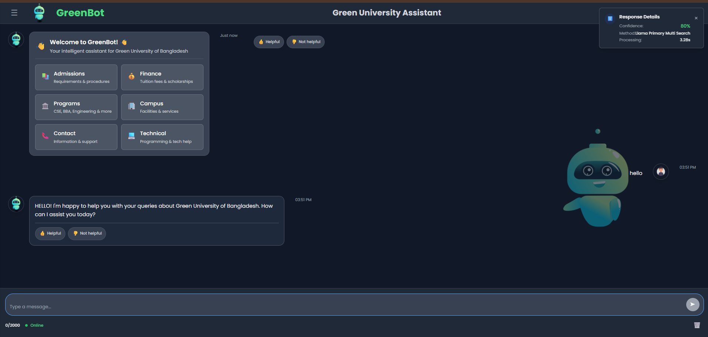
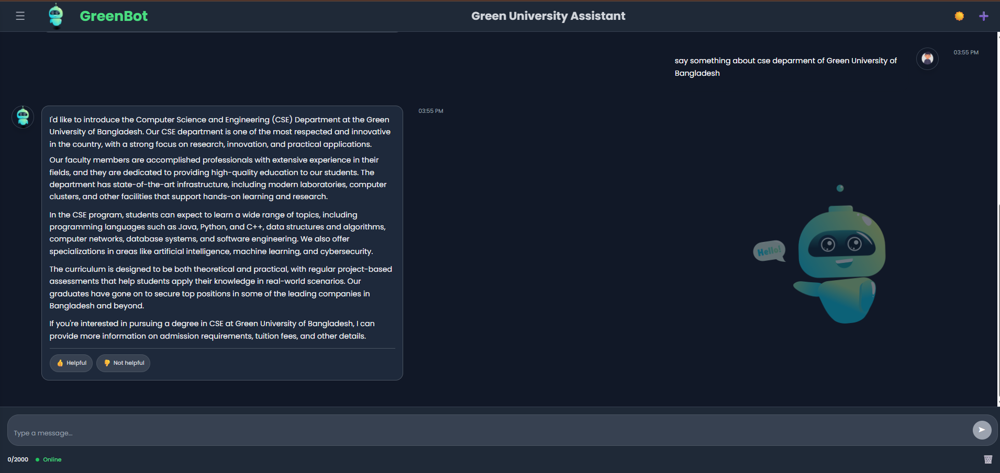

# GreenBot - AI Chatbot for Green University

A professional AI chatbot powered by LLaMA 3.2 and Retrieval-Augmented Generation (RAG), designed to provide intelligent, real-time assistance for students and visitors of Green University of Bangladesh.

---





---

## 🖼️ Project Overview

GreenBot is an advanced, web-based AI assistant tailored for educational institutions. It leverages the powerful LLaMA 3.2 language model and a comprehensive university knowledge base to answer queries, guide prospective students, and support existing students in real-time. The intuitive messenger-style interface makes it easy to interact with GreenBot on any device.

**Key Highlights:**
- **Intelligent Q&A:** Accurate answers about admissions, fees, programs, campus facilities, and more.
- **Modern UI:** Messenger-style chat with light/dark themes and responsive layout.
- **Feedback & Analytics:** Users can rate responses, and admins can view real-time analytics.
- **Powerful Backend:** Python Flask API with RAG methodology for context-aware, data-driven responses.
- **Easy Deployment:** Start both servers with a single script or manually; fully cross-platform.

---

## 🚀 Quick Start

### Option 1: Automatic Startup (Recommended)
Double-click `start_servers.bat` to automatically start both backend and frontend servers.

### Option 2: Manual Startup

1. **Start Backend Server:**
   ```powershell
   cd "d:\VS Code\bot\chatbot"
   .\.venv\Scripts\activate
   python backend/rag_api_server.py
   ```

2. **Start Frontend Server:**
   ```powershell
   cd "d:\VS Code\bot\chatbot\frontend"
   python -m http.server 3000
   ```

### Option 3: PowerShell Script
Run the PowerShell script:
```powershell
.\backend\run_rag_api_server.ps1
```

---

## 🌐 Access Your Chatbot

- **Frontend (Web Interface):** [http://localhost:3000](http://localhost:3000)
- **Backend (API):** [http://localhost:5000](http://localhost:5000)

---

## 📋 Prerequisites

1. **Python Virtual Environment** - Already configured
2. **Ollama** - Must be running with `llama3.2:1b` model
3. **Data Files** - University information loaded into backend

---

## 🎯 Features

- 🤖 **AI-Powered Responses** with LLaMA 3.2 for natural, detailed answers
- 📚 **University Knowledge Base** with 10,709+ data points (admissions, programs, scholarships, and more)
- 💬 **Professional Messenger UI:** 
  - Dark/light themes
  - Large, interactive chat area
  - Quick feedback buttons
- 📊 **Real-time Analytics** and feedback collection for response improvement
- 🔄 **Smart Response Methods:** 
  - JSON data search
  - LLaMA-3 enhancement
- 📱 **Responsive Design** for desktops, tablets, and mobiles

---

## 💡 Usage Tips

- Ask about admissions, available programs, tuition fees, campus facilities, and more.
- Example: _"What programs does Green University offer?"_
- Use feedback buttons to rate and improve answers.
- View conversation statistics and analytics in the sidebar.

---

## 🔧 Troubleshooting

**Server shows offline:**
- Ensure both backend and frontend servers are running.
- Check that Ollama is running: `ollama serve`
- Verify model is available: `ollama pull llama3.2:1b`

**Connection errors:**
- Frontend runs on port 3000
- Backend API runs on port 5000
- Both must be running at the same time for full functionality

---

## 📁 Project Structure

```
chatbot/
├── backend/
│   ├── rag_api_server.py      # Main Flask API server
│   ├── run_rag_api_server.ps1 # PowerShell startup script
│   ├── enhanced_ndata.json    # University data
│   └── green_university_30k_instruction_response.jsonl
├── frontend/
│   ├── index.html             # Main web interface
│   ├── script.js              # Frontend JavaScript
│   └── styles.css             # Custom styles
├── start_servers.bat          # Automatic startup script
└── .venv/                     # Python virtual environment
```

---

## 🏫 Example Interactions

- **Admissions:** Get detailed requirements and step-by-step application guidance.
- **Programs:** Learn about all offered programs, including CSE, BBA, Engineering, and more.
- **Fees:** Up-to-date tuition and scholarship information.
- **Campus:** Explore campus facilities and services.
- **Contact & Support:** Direct access to university contacts and tech support.
- **CSE Department Example:**
  - *"Tell me about the CSE department at Green University of Bangladesh."*


---


